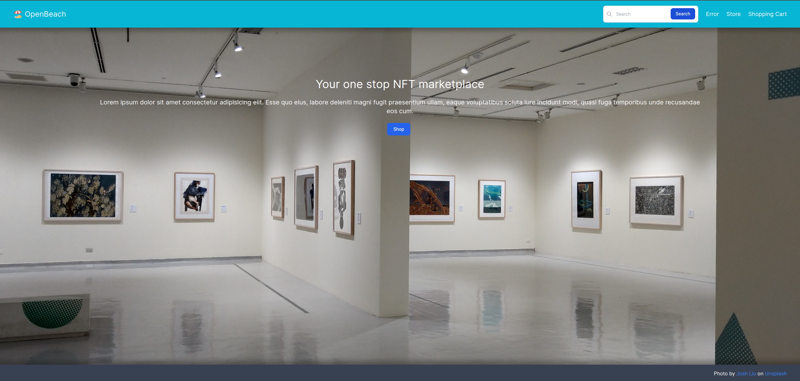

# Shopping Cart

### Shopping Cart for The Odin Project 🎮🎲🧠

Welcome to the Shopping Cart, a delightful project developed using React for The Odin Project.

This is a shopping application built using React. It uses React Router DOM for navigation and data fetching to display products and manage the shopping cart. Additionally, the application used tailwind CSS to style react components instead of plain CSS.

Click [HERE](https://shopping-cart-jpl8.onrender.com/) for the live demo!

